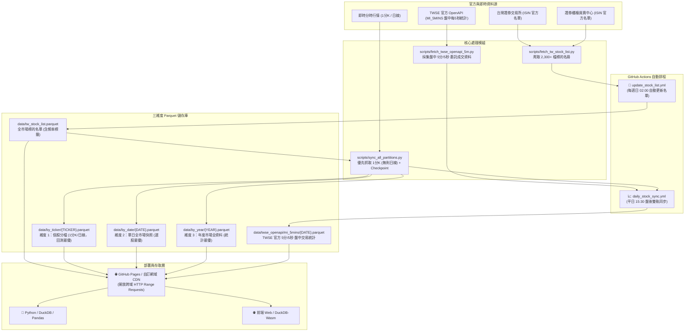

# 📈 TW Stock Data Hub (台灣股市 1 分 K 線與三維度開放數據庫)

[](https://www.python.org/)
[](https://parquet.apache.org/)
[](https://duckdb.org/)
[](https://github.com/features/actions)
[](https://pages.github.com/)
[](LICENSE)

> **每日自動抓取全台股 2,300+ 檔上市櫃股票與 ETF 之「1 分鐘 K 線」與「日線」資料，同時採集證交所官方 OpenAPI 盤中 5 分/5 秒委託成交統計，以 Apache Parquet 格式切分三大維度儲存，支援透過 GitHub Pages / 自訂網域進行跨網域 HTTP Range 極速查詢。**

---

## 🌟 核心特色

- ⏱️ **1 分鐘 K 線優先（1-Minute Intraday K-Bar）**：核心同步引擎優先採集 1 分鐘 K 線資料（包含開盤、最高、最低、收盤、成交量），若該標的無分時資料（如冷門股、權證等）則自動回退至日線，兼具高頻細膩度與全市場完整性。
- 🏛️ **TWSE 官方 OpenAPI 盤中統計**：每日收盤自動採集台灣證券交易所官方 OpenAPI 之「每 5 秒/5 分委託成交統計（`MI_5MINS`）」，並結構化計算每期增量成交筆數、張數與金額。
- 🆓 **完全零維護成本 (Serverless & Zero Cost)**：基於 Git Scraping 架構，排程與運算全由 GitHub Actions 託管，資料直接發布於 GitHub Pages，無需任何主機或資料庫租用費用。
- 🧊 **三維度分區儲存 (3-Dimensional Parquet Partitioning)**：針對「個股回測」、「盤後選股」與「大盤統計」三種常見情境實體切分，查詢效率提升 100 倍以上。
- ⚡ **DuckDB 跨網域秒級讀取**：支援 HTTP Range Requests，外部分析端（Python 或瀏覽器 Web）無需下載整個資料庫，僅傳輸幾 KB 即可完成 SQL 跨網域分析。
- 🛡️ **智能 Checkpoint 斷點續傳**：具備交易日檢查與批次原子落盤（Batch Flush），若今日已收盤且資料已落盤則秒級跳過；若中途中斷，可直接斷點續傳。

---

## 🏛️ 架構與運作流程



---

## 📂 資料夾結構與切分維度

```text
tw-stock-data/
├── .github/
│   └── workflows/
│       ├── update_stock_list.yml       # 每週日自動抓取上市櫃最新清單
│       └── daily_stock_sync.yml        # 平日收盤後更新 1分K/日線與 OpenAPI 統計
├── data/
│   ├── tw_stock_list.parquet           # 全台股標的名冊
│   ├── tw_stock_list.csv               # 名冊 CSV 備份
│   ├── by_ticker/                      # 【維度 1】個股全歷史 (1分K優先，無則日線)
│   ├── by_date/                        # 【維度 2】每日全市場快照 (例: 2026-09-08.parquet)
│   ├── by_year/                        # 【維度 3】年度市場全資料 (例: 2026.parquet)
│   └── twse_openapi/
│       └── mi_5mins/                   # 證交所官方每日盤中每5秒/5分委託成交統計
├── scripts/
│   ├── fetch_tw_stock_list.py          # 證交所/櫃買中心名冊爬蟲
│   ├── fetch_twse_openapi_5m.py        # 抓取 TWSE OpenAPI MI_5MINS 統計
│   └── sync_all_partitions.py          # 1分K優先/日線回退 雙軌同步與 Checkpoint 引擎
├── index.html                          # GitHub Pages 門戶入口與文件導覽
├── query_example.py                    # DuckDB 跨維度分析查詢範例
├── requirements.txt                    # 相依套件清單
├── .nojekyll                           # 確保 GitHub Pages 完整提供 Parquet 靜態檔案
└── README.md
```

### 三大維度選擇指南

| 維度目錄 | 分檔方式 | 包含欄位 | 適用場景 |
| :--- | :--- | :--- | :--- |
| `data/by_ticker/` | 一檔個股一個檔案 | `Datetime` (或 `Date`), `Open`, `High`, `Low`, `Close`, `Volume` | 單股高頻回測、技術指標計算 (1分K優先) |
| `data/by_date/` | 一個交易日一個檔案 | `Datetime` (或 `Date`), `Ticker`, `Open`, `High`, `Low`, `Close`, `Volume` | 盤後選股、當日高解析分時快照 |
| `data/by_year/` | 一個年份一個檔案 | `Date`, `Ticker`, `Open`, `High`, `Low`, `Close`, `Volume` | 跨年度大盤趨勢、成交量週期分析 (日線彙整) |
| `data/twse_openapi/mi_5mins/` | 一個交易日一個檔案 | `Time`, `AccTransaction`, `IntervalTransaction`, `AccTradeVolume`, `IntervalTradeVolume` 等 | 全市場盤中資金動能、每5秒/5分買賣力道研究 |

---

## 🌐 透過 GitHub Pages 與自訂網域跨網域存取

本專案支援透過 GitHub Pages 與自訂網域作為公開靜態 CDN：

- **自訂網域 API 端點**：`https://stocks.blackboxop.eu.cc/data`
- **GitHub Pages 預設端點**：`https://<username>.github.io/<repo>/data`

### 1. 公開 API 端點範例
```text
# 1. 官方標的名冊
https://stocks.blackboxop.eu.cc/data/tw_stock_list.parquet

# 2. 個股 1 分 K 線 / 日線 (以 2330 台積電為例，.TW 改為 _TW)
https://stocks.blackboxop.eu.cc/data/by_ticker/2330_TW.parquet

# 3. 當日全市場快照
https://stocks.blackboxop.eu.cc/data/by_date/2026-09-08.parquet

# 4. 年度市場彙整
https://stocks.blackboxop.eu.cc/data/by_year/2026.parquet

# 5. TWSE 官方 5 分/5 秒盤中委託成交統計
https://stocks.blackboxop.eu.cc/data/twse_openapi/mi_5mins/2026-09-09.parquet
```

---

## 💻 快速查詢範例 (Python + DuckDB)

```python
import duckdb

# 自訂網域或本地目錄皆可直接查詢
BASE_URL = "https://stocks.blackboxop.eu.cc/data"

# 1. 查詢台積電 (2330) 最近 5 根 1 分鐘 K 線 (若該股僅日線則欄位為 Date)
df_tsmc = duckdb.query(f"""
    SELECT Datetime, Open, High, Low, Close, Volume 
    FROM '{BASE_URL}/by_ticker/2330_TW.parquet' 
    ORDER BY Datetime DESC 
    LIMIT 5
""").df()
print("=== 2330.TW 最新 1 分 K 線 ===")
print(df_tsmc)

# 2. 查詢 TWSE 官方 OpenAPI 盤中每 5 秒/5 分委託成交爆量時段
df_openapi = duckdb.query(f"""
    SELECT Time_Formatted as Time, IntervalTransaction, IntervalTradeVolume, IntervalTradeValue 
    FROM '{BASE_URL}/twse_openapi/mi_5mins/2026-09-09.parquet' 
    ORDER BY IntervalTradeVolume DESC 
    LIMIT 5
""").df()
print("\n=== TWSE 官方盤中成交爆量時段 ===")
print(df_openapi)
```

---

## 🛡️ 智能 Checkpoint 與斷點續傳

1. **優先採集 1 分線**：
   抓取前優先請求 1 分線；若標的無分時成交紀錄，無縫回退至日線，兼顧高頻精度與全市場覆蓋率。
2. **自動跳過已更新標的**：
   抓取前檢查本地 Parquet，若最新數據已涵蓋今日收盤價（盤後 14:00 後），自動跳過，避免重複網路呼叫與 API 頻率限制。
3. **批次原子落盤 (Batch Flush)**：
   預設每 20 檔（可自訂 `--batch-size`）統一寫入 `by_ticker`、`by_date` 與 `by_year`，避免記憶體超載，並確保中斷時各維度資料一致。
4. **年份維度智慧彙整 (GitHub 100MB 限制保護)**：
   `by_year` 於寫入時自動將分時數據彙整為單日日線 OHLCV，確保年檔體積極輕量，永久避免觸碰 GitHub 單檔 100MB 上傳上限。

### 命令列常用指令

```bash
# 1. 一般增量同步 (優先抓 1分K，無則抓日線，自動跳過今日已抓個股)
python scripts/sync_all_partitions.py

# 2. 抓取 TWSE OpenAPI 官方 5 分盤中委託成交資料
python scripts/fetch_twse_openapi_5m.py

# 3. 全歷史初始化
python scripts/sync_all_partitions.py --init

# 4. 強制更新 (忽略 Checkpoint，強制重新抓取覆蓋)
python scripts/sync_all_partitions.py --force

# 5. 抽樣測試前 10 檔
python scripts/sync_all_partitions.py --limit 10
```

---

## ⚠️ 免責聲明 (Disclaimer)

1. **非投資建議**：本專案（包含所有腳本代碼、自動化工作流、Parquet 資料庫檔案、說明文件及公開 API）僅供學術研究、技術交流與量化回測學習使用，**不構成任何形式之投資建議、財務諮詢、買賣推薦或操盤指引**。
2. **資料精確度與即時性**：本專案數據彙整自公開網路行情與證交所/櫃買中心開放資料，可能因來源端更新時差、網路延遲、API 異動或資料清洗邏輯而存在延遲、缺漏或誤差。專案維護者不對資料之即時性、正確性、完整性或特定用途的有效性作任何明示或暗示之保證。
3. **投資風險與損益自負**：金融市場具高度風險。任何使用者依據本專案內容或產出數據所進行之投資、交易或策略操作，其產生之所有直接、間接損益與風險，**概由使用者全權承擔**，專案維護者與貢獻者概不承擔任何法律、民刑事賠償或連帶責任。

---

## 📄 License
This project is open-source and licensed under the [MIT License](LICENSE).
資料來源為台灣證券交易所 (TWSE)、證券櫃檯買賣中心 (TPEx) 及公開行情數據，相關權利均歸原機構所有。