# 📈 TW Stock Data Hub (台股全方位開源量化數據倉儲)

<p align="center">
  <a href="https://www.python.org/"></a>
  <a href="https://parquet.apache.org/"></a>
  <a href="https://duckdb.org/"></a>
  <a href="https://github.com/features/actions"></a>
  <a href="https://pages.github.com/"></a>
  <a href="LICENSE"></a>
</p>

<p align="center">
  <b>全台股 2,300+ 檔標的 • 1 分鐘 K 線高頻資料 • 12+ 維度籌碼與基本面 • 跨網域 HTTP Range 秒級 SQL 分析</b><br>
  <sub>無需架設資料庫、零伺服器維護成本，隨取即用的開源台股量化數據中樞</sub>
</p>

---

> [!TIP]
> **專案核心理念**：基於 **Git Scraping** 與 **Serverless** 架構，由 GitHub Actions 每日盤後定時抓取、清洗並落盤為標準 **Apache Parquet** 檔案。透過自訂網域 CDN 與 GitHub Pages 發布，外部分析端（Python、R、Jupyter 或瀏覽器 Web DuckDB-Wasm）**無需下載整份資料庫**，即可透過 **HTTP Range Requests** 數毫秒內完成 SQL 關聯查詢與策略選股！

---

## 📑 目錄導覽

- [🌟 核心亮點](#-核心亮點)
- [📊 全維度數據庫矩陣](#-全維度數據庫矩陣)
- [🏛️ 系統架構與自動化管線](#️-系統架構與自動化管線)
- [📂 專案結構與目錄導覽](#-專案結構與目錄導覽)
- [🌐 公開 CDN 端點清單](#-公開-cdn-端點清單)
- [🚀 快速開始 (DuckDB + Python)](#-快速開始-duckdb--python)
- [💡 實戰量化選股與策略分析範例](#-實戰量化選股與策略分析範例)
  - [1. 跨表多維度綜合選股 (籌碼 + 評價 + 營收成長 + EPS)](#1-跨表多維度綜合選股-籌碼--評價--營收成長--eps)
  - [2. 追蹤券商主力分點進出與持股成本](#2-追蹤券商主力分點進出與持股成本)
  - [3. 期交所期貨大額未平倉與借券賣出避險指標](#3-期交所期貨大額未平倉與借券賣出避險指標)
- [📈 每日盤後量化日報](#-每日盤後量化日報)
- [🛠️ 本地命令列操作指南](#️-本地命令列操作指南)
- [⚠️ 免責聲明 & License](#️-免責聲明--license)

---

## 🌟 核心亮點

| 特色 | 說明 |
| :--- | :--- |
| ⏱️ **1 分鐘 K 線優先採集** | 優先採集全市場高頻 1 分鐘 K 線（開高低收量 OHLCV），無分時交易之冷門標的自動回退日線，兼顧高解析度與全市場完整性。 |
| 🧩 **12+ 全維度數據深度覆蓋** | 涵蓋技術線圖、TWSE 盤中 5 秒/5 分委託統計、三大法人、融資融券、券商分點主力、集保千張大戶、期貨法人部位、借券賣出、營收、EPS、估值及除權息。 |
| ⚡ **DuckDB 跨網域秒級查詢** | 善用 Parquet 欄式儲存與 Snappy 壓縮特性，透過 HTTP Range Requests 僅抓取必要 Byte Range，無需下載數十 GB 檔案即可完成 SQL 分析。 |
| 🧊 **三維度 Parquet 實體切分** | 個股全歷史 (`by_ticker`)、單日全市場快照 (`by_date`)、年度日線彙整 (`by_year`)，各場景查詢效能皆獲最佳化。 |
| 🤖 **完全零運算與主機維護成本** | 純 Serverless 架構，排程運算完全託管於 GitHub Actions，檔案託管於 CDN，永久免付主機與雲端資料庫費用。 |
| 🛡️ **智慧 Checkpoint 斷點續傳** | 具備交易日狀態檢驗、已落盤標的秒級跳過、批次原子寫入機制，並自動對年度日線聚合，徹底規避 GitHub 單檔 100MB 限制。 |

---

## 📊 全維度數據庫矩陣

本數據倉儲每日由自動化管線標準化落盤為 Apache Parquet，涵蓋以下 12 大面向：

| 面向 | 資料項目 | 涵蓋範圍與深度 | Parquet 儲存路徑 | 更新排程 (台灣時間) | 核心指標 / 欄位 |
| :--- | :--- | :--- | :--- | :--- | :--- |
| **技術面** | **1 分鐘 K 線**<br/>(無則回退日線) | 全市場 2,300+ 檔<br/>上市、上櫃、ETF | `data/by_ticker/{ticker}.parquet`<br/>`data/by_date/{date}.parquet` | 每日盤後 15:40 | `Open`, `High`, `Low`, `Close`, `Volume`, `Datetime` |
| **盤中高頻** | **TWSE 盤中成交統計** | 上市全市場 | `data/twse_openapi/mi_5mins/{date}.parquet` | 每日盤後 15:40 | 每 5 秒/5 分累計與間隔成交筆數、張數、金額 |
| **籌碼面** | **三大法人買賣超** | 上市 + 上櫃 | `data/institutional/{date}.parquet` | 每日盤後 15:40 | 外資、投信、自營商（自買/避險）買賣超張數與金額 |
| **籌碼面** | **融資融券信用交易** | 上市 + 上櫃 | `data/margin/{date}.parquet` | 每日夜間 20:30 | 資券餘額、當日增減、限額、資券使用率與互抵 |
| **籌碼面** | **券商分點主力明細** | 權值與焦點股<br/>(嘉實資訊來源) | `data/chips/broker_trading/{date}.parquet` | 每日夜間 20:30 | 前 15 大買賣分點名稱、進出張數、買賣佔比、均價成本 |
| **籌碼面** | **集保股權分散表** | 全市場 4,000+ 檔<br/>(臺灣集中保管結算所) | `data/chips/tdcc/{date}.parquet` | 每週五盤後 | 千張大戶持股比例、400 張大戶比例、百張散戶人數與佔比 |
| **衍生與避險** | **期交所三大法人未平倉** | 台指期、小台、電子期等 (TAIFEX) | `data/taifex/institutional/{date}.parquet` | 每日盤後 15:40 | 外資/投信/自營之多方、空方、淨未平倉口數與當日變動 |
| **衍生與避險** | **TWSE 借券賣出管制** | 上市市場 (TWSE SBL) | `data/margin/sbl/{date}.parquet` | 每日夜間 20:30 | 借券賣出當日成交、當日還券、借券餘額與信用管制上限 |
| **評價面** | **本益比與殖利率** | 上市 + 上櫃 | `data/valuation/{date}.parquet` | 每日盤後 15:40 | 本益比 (P/E)、殖利率 (Yield %)、股價淨值比 (P/B) |
| **基本面** | **月營收彙總** | 上市 + 上櫃 | `data/fundamental/revenue/{YYYY-MM}.parquet` | 每月 1~10 號 | 當月營收、上月營收、去年同月營收、MoM%、YoY%、累計營收 |
| **基本面** | **季報損益與 EPS** | 上市 + 上櫃 | `data/fundamental/eps/{YYYY}_Q{Q}.parquet` | 每季財報季 | 營業收入、營業利益、稅後淨利、每股盈餘 EPS |
| **市場與事件** | **大盤與各類股指數**<br/>**除權除息預告表** | 上市全類股指數<br/>上市櫃除權息名單 | `data/market_indices/{date}.parquet`<br/>`data/dividends/upcoming.parquet` | 每日盤後 15:40 | 大盤及各產業指數漲跌；即將除權息標的之現金/股票股利 |

---

## 🏛️ 系統架構與自動化管線

```mermaid
flowchart TD
    subgraph SOURCING["📡 多源官方與即時數據節點"]
        SRC_TWSE["🏛️ TWSE 證交所 (OpenAPI / ISIN 名冊 / 指數 / 借券 SBL)"]
        SRC_TPEX["🏢 TPEx 證券櫃檯買賣中心 (上櫃行情 / 法人 / 信用)"]
        SRC_TAIFEX["📊 TAIFEX 期交所 (三大法人期貨未平倉部位)"]
        SRC_TDCC["🏦 TDCC 臺灣集中保管結算所 (千張大戶股權分散)"]
        SRC_BROKER["🏪 券商主力分點數據源 (嘉實 / 富邦 DJ 行情)"]
        SRC_YF["📈 實時分時交易源 (全市場 1 分 K / 日線行情)"]
    end

    subgraph SCHEDULER["⚙️ GitHub Actions 雲端自動調度"]
        W_LIST["📅 update_stock_list.yml<br/>(每週日 02:00 自動刷新上市櫃名冊)"]
        W_DAILY["📈 daily_stock_sync.yml<br/>(平日 15:40 / 20:40 盤後雙軌同步)"]
    end

    subgraph ENGINE["🧪 核心萃取、清洗與校驗管線"]
        E_FETCH["腳本叢集 (scripts/fetch_*.py)"]
        E_CHECK["智能 Checkpoint 檢驗 (自動跳過已抓標的 / 交易日判斷)"]
        E_BATCH["批次原子聚合落盤 (Batch Flush & 年線聚合保護)"]
        E_REPORT["每日量化總覽報告生成器 (generate_daily_report.py)"]
    end

    subgraph STORAGE["🗄️ Apache Parquet 開源資料倉儲"]
        P_LIST["data/tw_stock_list.parquet (全市場 2,300+ 標的名冊)"]
        P_TECH["data/by_ticker/ & by_date/ (1 分 K 線 & 日線快照)"]
        P_CHIPS["data/institutional/ & margin/ & chips/ (全方位籌碼)"]
        P_DERIV["data/taifex/ & margin/sbl/ (期貨未平倉 & 借券賣出)"]
        P_FUND["data/fundamental/ (月營收 & 季報 EPS 歷史)"]
        P_REP["reports/{DATE}_market_summary.md (每日大盤量化日報)"]
    end

    subgraph DISTRIBUTION["🌐 高可用 CDN 跨網域發布層"]
        CDN_PAGES["🚀 GitHub Pages CDN (免下載整包庫)"]
        CDN_CUSTOM["⚡ 自訂網域 CDN: stocks.blackboxop.eu.cc"]
    end

    subgraph CLIENTS["💻 客戶消費端 (HTTP Range 秒級讀取)"]
        APP_DUCK["🦆 DuckDB (SQL 跨表秒級關聯)"]
        APP_PY["🐍 Python / Pandas / Polars"]
        APP_WASM["🌐 前端網頁 / DuckDB-Wasm / Observable"]
        APP_BI["📊 BI 視覺化看板 / Jupyter Notebook"]
    end

    SOURCING --> SCHEDULER
    SCHEDULER --> ENGINE
    ENGINE --> STORAGE
    STORAGE --> DISTRIBUTION
    DISTRIBUTION --> CLIENTS
```



---

## 📂 專案結構與目錄導覽

```text
tw_stock/
├── .github/
│   └── workflows/
│       ├── update_stock_list.yml       # 每週日自動更新全市場 2,300+ 檔標的名冊
│       └── daily_stock_sync.yml        # 平日盤後自動執行多階段資料擷取與日報生成
├── data/
│   ├── tw_stock_list.parquet           # 全台股標的名冊 (代號、名稱、市場、產業)
│   ├── tw_stock_list.csv               # 名冊 CSV 格式備份
│   ├── by_ticker/                      # 【維度 1】個股全歷史 (1分K優先，無則回退日線)
│   ├── by_date/                        # 【維度 2】每日全市場行情快照
│   ├── by_year/                        # 【維度 3】年度全市場日線彙整 (規避 100MB 限制)
│   ├── twse_openapi/
│   │   └── mi_5mins/                   # 【盤中統計】TWSE 官方盤中 5 秒/5 分成交量價筆數
│   ├── institutional/                  # 【籌碼面】三大法人每日買賣超 (上市 + 上櫃)
│   ├── margin/
│   │   ├── sbl/                        # 【借券避險】TWSE 借券賣出當日成交、還券與餘額
│   │   └── {date}.parquet              # 【信用交易】融資融券餘額、增減與使用率
│   ├── chips/
│   │   ├── broker_trading/             # 【主力分點】前 15 大券商買賣明細與均價成本
│   │   └── tdcc/                       # 【大戶籌碼】集保千張大戶、400張大戶持股比例
│   ├── valuation/                      # 【評價面】每日本益比、股價淨值比、殖利率
│   ├── fundamental/
│   │   ├── revenue/                    # 【基本面】月營收彙總 (當月、MoM%、YoY%、累計)
│   │   └── eps/                        # 【基本面】季報每股盈餘 EPS 與損益表
│   ├── taifex/
│   │   └── institutional/              # 【期貨籌碼】期交所三大法人大額期貨部位未平倉
│   ├── market_indices/                 # 【市場面】加權指數與各產業分類指數表現
│   └── dividends/                      # 【事件面】除權除息預告表與股利資訊
├── reports/                            # 【量化日報】每日自動產出之 Markdown 盤後總覽報告
├── scripts/
│   ├── sync_all_partitions.py          # 1分K/日線雙軌增量同步與 Checkpoint 引擎
│   ├── generate_daily_report.py        # 每日量化盤後總覽儀表板日報產生器
│   ├── fetch_tw_stock_list.py          # 證交所/櫃買中心官方名冊爬蟲
│   ├── fetch_twse_openapi_5m.py        # TWSE OpenAPI 盤中 5 分統計擷取
│   ├── fetch_institutional_daily.py    # 三大法人買賣超擷取 (上市 + 上櫃)
│   ├── fetch_margin_daily.py           # 融資融券信用交易擷取 (上市 + 上櫃)
│   ├── fetch_taifex_institutional.py   # 期交所三大法人期貨未平倉擷取
│   ├── fetch_sbl_daily.py              # TWSE 借券賣出與信用總量管制擷取
│   ├── fetch_broker_trading.py         # 券商分點主力買賣明細擷取 (嘉實 DJ)
│   ├── fetch_tdcc_distribution.py      # 集保戶股權分散與千張大戶比例擷取
│   ├── fetch_valuation_daily.py        # 本益比、殖利率、淨值比擷取
│   ├── fetch_monthly_revenue.py        # 上市櫃月營收歷史彙整
│   ├── fetch_quarterly_eps.py          # 上市櫃季報 EPS 與損益表擷取
│   ├── fetch_market_indices.py         # 大盤及各類股指數報表擷取
│   ├── fetch_dividends.py              # 除權除息預告與計算結果擷取
│   ├── backfill_history.py             # 籌碼與評價面歷史多日批次回補
│   ├── backfill_fundamental.py         # 多年歷史營收與季報 EPS 大規模回補
│   └── db_helper.py                    # SQLite 本地存儲相容模組
├── query_example.py                    # DuckDB 全維度 11 大實戰查詢範例腳本
├── index.html                          # GitHub Pages 門戶導覽頁面
├── requirements.txt                    # 專案相依套件清單
└── README.md                           # 專案完整技術手冊
```

---

## 🌐 公開 CDN 端點清單

本專案支援透過自訂網域或 GitHub Pages 作為全域靜態 CDN，所有檔案均支援 **HTTP Range Requests**：

- **自訂網域 CDN 端點**：`https://stocks.blackboxop.eu.cc/data`
- **GitHub Pages 預設端點**：`https://blackboxop.github.io/tw_stock/data`

| 項目名稱 | 檔案 URL 範例 |
| :--- | :--- |
| **全市場標的名冊** | `https://stocks.blackboxop.eu.cc/data/tw_stock_list.parquet` |
| **個股 1 分 K 線 (台積電)** | `https://stocks.blackboxop.eu.cc/data/by_ticker/2330_TW.parquet` |
| **每日全市場快照** | `https://stocks.blackboxop.eu.cc/data/by_date/2026-09-08.parquet` |
| **年度日線市場彙整** | `https://stocks.blackboxop.eu.cc/data/by_year/2026.parquet` |
| **三大法人買賣超** | `https://stocks.blackboxop.eu.cc/data/institutional/2026-09-08.parquet` |
| **融資融券信用交易** | `https://stocks.blackboxop.eu.cc/data/margin/2026-09-08.parquet` |
| **借券賣出 (SBL)** | `https://stocks.blackboxop.eu.cc/data/margin/sbl/2026-09-08.parquet` |
| **期貨三大法人部位 (TAIFEX)**| `https://stocks.blackboxop.eu.cc/data/taifex/institutional/2026-09-08.parquet` |
| **券商分點主力買賣** | `https://stocks.blackboxop.eu.cc/data/chips/broker_trading/2026-09-08.parquet` |
| **集保千張大戶分散** | `https://stocks.blackboxop.eu.cc/data/chips/tdcc/2026-09-04.parquet` |
| **本益比與殖利率** | `https://stocks.blackboxop.eu.cc/data/valuation/2026-09-08.parquet` |
| **月營收彙總** | `https://stocks.blackboxop.eu.cc/data/fundamental/revenue/2026-07.parquet` |
| **季報 EPS 損益表** | `https://stocks.blackboxop.eu.cc/data/fundamental/eps/2026_Q2.parquet` |
| **除權除息預告表** | `https://stocks.blackboxop.eu.cc/data/dividends/upcoming.parquet` |

---

## 🚀 快速開始 (DuckDB + Python)

### 1. 安裝必要套件

```bash
pip install duckdb pandas
```

### 2. 極簡 3 行遠端查詢台積電 1 分 K 線

無論是在本地終端機或 Jupyter Notebook，DuckDB 可直接向 CDN 發送 HTTP Range 請求，**免下載完整檔案即可極速取得資料**：

```python
import duckdb

# 直接向自訂網域 CDN 查詢台積電 (2330_TW) 最新 5 筆 1 分 K 線
df = duckdb.query("""
    SELECT Datetime, Open, High, Low, Close, Volume 
    FROM 'https://stocks.blackboxop.eu.cc/data/by_ticker/2330_TW.parquet' 
    ORDER BY Datetime DESC 
    LIMIT 5
""").df()

print(df)
```

---

## 💡 實戰量化選股與策略分析範例

### 1. 跨表多維度綜合選股 (籌碼 + 評價 + 營收成長 + EPS)

> **選股策略邏輯**：外資與投信**同步買超** + 融資減肥籌碼沉澱 + 本益比合理 (< 25) + 月營收年增率 **YoY > 10%** + 單季 **EPS > 1.0 元**。

```python
import duckdb

BASE_URL = "https://stocks.blackboxop.eu.cc/data"
DATE = "2026-09-08"

query = f"""
SELECT 
    i.Ticker,
    i.Name,
    i.Market,
    i.Foreign_Net / 1000 AS Foreign_K_Shares,
    i.Trust_Net / 1000 AS Trust_K_Shares,
    (m.Margin_Balance - m.Margin_Prev_Balance) AS Margin_Net_Change,
    v.PE_Ratio,
    v.Dividend_Yield,
    r.YoY_Growth AS Rev_YoY_Growth,
    e.EPS
FROM '{BASE_URL}/institutional/{DATE}.parquet' i
LEFT JOIN '{BASE_URL}/margin/{DATE}.parquet' m ON i.Ticker = m.Ticker
LEFT JOIN '{BASE_URL}/valuation/{DATE}.parquet' v ON i.Ticker = v.Ticker
LEFT JOIN '{BASE_URL}/fundamental/revenue/2026-07.parquet' r ON i.Ticker = r.Ticker
LEFT JOIN '{BASE_URL}/fundamental/eps/2026_Q2.parquet' e ON i.Ticker = e.Ticker
WHERE i.Foreign_Net > 0 
  AND i.Trust_Net > 0
  AND r.YoY_Growth > 10.0
  AND e.EPS > 1.0
ORDER BY i.Foreign_Net DESC
LIMIT 10;
"""

df_quant = duckdb.query(query).df()
print(df_quant)
```

### 2. 追蹤券商主力分點進出與持股成本

> **策略邏輯**：深入觀察主力大戶在關鍵標的（如台積電 2330）的集中度，找出前三大買超券商分點與其平均建倉成本價。

```python
import duckdb

BASE_URL = "https://stocks.blackboxop.eu.cc/data"
DATE = "2026-09-08"

df_broker = duckdb.query(f"""
    SELECT 
        Date, Ticker, Name, Rank,
        Broker_Name, Net_Qty, Share_Pct, Total_Buy, Avg_Buy_Cost
    FROM '{BASE_URL}/chips/broker_trading/{DATE}.parquet'
    WHERE Ticker = '2330' AND Side = 'buy'
    ORDER BY Rank ASC
    LIMIT 3
""").df()

print(df_broker)
```

### 3. 期交所期貨大額未平倉與借券賣出避險指標

> **策略邏輯**：大盤風向看期貨淨未平倉，個股潛在空方與避險賣壓看 TWSE 借券賣出（SBL）餘額與還券動態。

```python
import duckdb

BASE_URL = "https://stocks.blackboxop.eu.cc/data"
DATE = "2026-09-08"

# 1. 查詢台指期外資與投信未平倉口數
df_futures = duckdb.query(f"""
    SELECT Commodity, Institution, Net_Volume, OI_Long_Volume, OI_Short_Volume, OI_Net_Volume
    FROM '{BASE_URL}/taifex/institutional/{DATE}.parquet'
    WHERE Commodity = '臺股期貨'
""").df()
print("=== 台指期大額法人未平倉 ===")
print(df_futures)

# 2. 查詢大型權值股借券賣出 (SBL) 還券與餘額
df_sbl = duckdb.query(f"""
    SELECT Ticker, Name, SBL_Daily_Return / 1000 AS Return_K, SBL_Daily_Sell / 1000 AS Sell_K, SBL_Balance / 1000 AS Balance_K
    FROM '{BASE_URL}/margin/sbl/{DATE}.parquet'
    WHERE Ticker IN ('2330', '2317', '2454', '2382')
    ORDER BY Balance_K DESC
""").df()
print("\n=== 權值股借券賣出狀況 ===")
print(df_sbl)
```

> [!NOTE]
> 更多實戰查詢（包含集保千張大戶比例、TWSE 盤中 5 分委託爆量時段、除權息現金股利排行等），請參閱 [`query_example.py`](query_example.py)。

---

## 📈 每日盤後量化日報

專案內建自動化日報生成器 [`scripts/generate_daily_report.py`](scripts/generate_daily_report.py)，每日收盤後自動整合跨維度數據，於 [`reports/`](reports/) 目錄產出 Markdown 格式之大盤量化日報：

### 日報重點涵蓋內容：
1. **大盤與各類股核心指數**（加權指數、寶島指數、臺灣50、各產業類股漲跌幅）
2. **期交所三大法人期貨未平倉**（台指期、小台、電子期外資多空風向球）
3. **現貨三大法人買賣超動向**（上市與上櫃外資、投信、自營合計）
4. **信用籌碼與借券避險力道**（融資融券增減與 SBL 借券總量變化）
5. **法人同步大買精選 TOP 10**（外資與投信合力加碼之強勢標的）
6. **借券賣出空單大回補 TOP 10**（SBL 還券大增、潛在軋空與反彈標的）

👉 查看最新產生日報範例：[`reports/2026-09-09_market_summary.md`](reports/2026-09-09_market_summary.md)

---

## 🛠️ 本地命令列操作指南

### 1. 例行盤後增量同步

```bash
# 增量抓取技術面 1分K / 日線行情 (內建 Checkpoint 自動跳過今日已抓個股)
python scripts/sync_all_partitions.py

# 採集 TWSE OpenAPI 盤中 5 分/5 秒委託成交資料
python scripts/fetch_twse_openapi_5m.py

# 採集現貨三大法人買賣超 (上市 + 上櫃)
python scripts/fetch_institutional_daily.py

# 採集融資融券信用交易餘額 (上市 + 上櫃)
python scripts/fetch_margin_daily.py

# 採集每日本益比、股價淨值比與殖利率
python scripts/fetch_valuation_daily.py

# 採集期交所三大法人大額期貨部位
python scripts/fetch_taifex_institutional.py

# 採集 TWSE 借券賣出與信用總量管制
python scripts/fetch_sbl_daily.py

# 採集券商主力分點進出 (指定核心標的並匯出 Parquet)
python scripts/fetch_broker_trading.py --stocks 2330 2317 2454 2308 2382 --export-parquet

# 產出今日盤後量化總覽日報
python scripts/generate_daily_report.py
```

### 2. 歷史資料批量回補 (Historical Backfill)

```bash
# 批次回補最近 30 個交易日之三大法人、資券與本益比資料 (自動斷點續傳)
python scripts/backfill_history.py --days 30

# 指定日期區間回補
python scripts/backfill_history.py --start 2026-08-01 --end 2026-09-08

# 全量回補多年基本面 (32 個月月營收 + 10 季 EPS 損益歷史)
python scripts/backfill_fundamental.py
```

### 3. 週度與月度專項更新

```bash
# 更新全台股上市櫃標的名冊 (每週日定期自動執行)
python scripts/fetch_tw_stock_list.py

# 抓取集保戶股權分散表與千張大戶比例 (每週五盤後)
python scripts/fetch_tdcc_distribution.py

# 抓取上市櫃月營收彙總 (每月 1~10 號)
python scripts/fetch_monthly_revenue.py

# 抓取季報損益表與每股盈餘 EPS (每季財報公布期)
python scripts/fetch_quarterly_eps.py

# 抓取即將除權除息預告表與計算結果
python scripts/fetch_dividends.py
```

### 4. 執行本地 / 遠端完整驗證範例

```bash
# 執行 11 大維度實戰 SQL 查詢驗證腳本
python query_example.py
```

---

## ⚠️ 免責聲明 & License

> [!WARNING]
> ### 免責聲明 (Disclaimer)
> 1. **非投資建議**：本專案（包含所有腳本原始碼、自動化工作流、Parquet 數據庫檔案、盤後量化日報及公開 CDN API）僅供學術研究、技術交流與量化回測學習使用，**不構成任何形式之投資建議、財務諮詢、買賣推薦或操盤指引**。
> 2. **數據準確度與延遲**：本專案數據彙整自公開網路行情及各大官方機構開放資料，可能因來源端更新時差、網路延遲或格式異動而存在些許落後或誤差。專案維護者不對資料之即時性、完整性或特定策略之有效性作任何明示或暗示之保證。
> 3. **投資風險與損益自負**：金融市場具高度風險。任何使用者依據本專案內容或產出數據所進行之投資或交易行為，其產生之所有直接、間接損益與風險，**概由使用者全權承擔**。

### 資料來源與權利宣告
- 數據來源為台灣證券交易所 (TWSE)、證券櫃檯買賣中心 (TPEx)、臺灣期貨交易所 (TAIFEX)、臺灣集中保管結算所 (TDCC)、公開資訊觀測站 (MOPS) 及相關公開行情資訊，相關智財權均歸原發布機構所有。

### 授權條款
- 本專案代碼與架構遵循 [MIT License](LICENSE) 開源授權。
