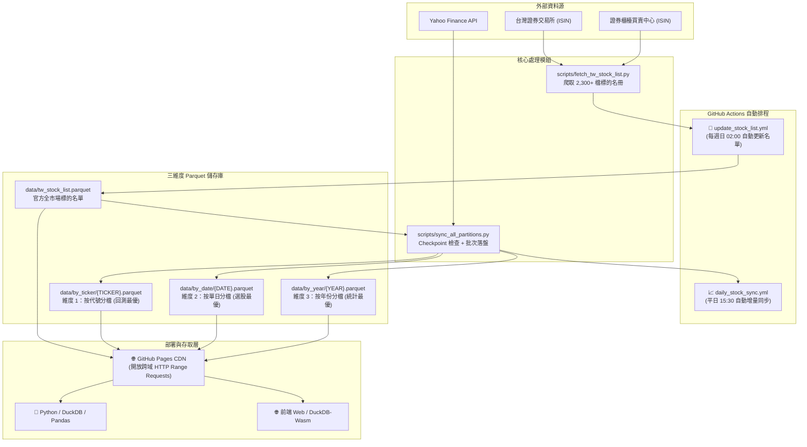

# 📈 TW Stock Data Hub (台灣股市三維度開放數據庫)

[](https://www.python.org/)
[](https://parquet.apache.org/)
[](https://duckdb.org/)
[](https://github.com/features/actions)
[](https://pages.github.com/)
[](LICENSE)

> **每日自動抓取台灣上市櫃 2,300+ 檔股票與 ETF 之日線價量資料，以 Apache Parquet 格式同時儲存為三大維度，支援透過 GitHub Pages 進行跨網域 HTTP Range 極速查詢。**

---

## 🌟 核心特色

- 🆓 **完全零維護成本 (Serverless & Zero Cost)**：基於 Git Scraping 架構，運算全由 GitHub Actions 負責，資料直接託管於 GitHub Pages，無需任何主機或雲端資料庫租用費用。
- 🧊 **三維度分區儲存 (3-Dimensional Parquet Partitioning)**：針對「單股回測」、「盤後選股」與「大盤統計」三種常見需求進行實體切分，查詢效率提升 100 倍以上。
- ⚡ **DuckDB 跨網域秒級讀取**：支援 HTTP Range Requests，外部分析程式無需下載整個幾 GB 的資料庫，僅需傳輸幾 KB 的 Metadata 與指定數據欄位。
- 🛡️ **智能 Checkpoint 斷點續傳**：具備個股交易日檢查與批次原子落盤（Batch Flush），若今日已抓取自動秒級跳過；若中途中斷，可直接斷點續傳無痛接關。
- 🔄 **雙軌自動排程**：每週日自動爬取證交所與櫃買中心最新代碼名冊；平日收盤後自動增量同步最新收盤價量。

---

## 🏛️ 架構與運作流程



---

## 📂 資料夾結構與切分維度

```text
tw-stock-data/
├── .github/
│   └── workflows/
│       ├── update_stock_list.yml    # 每週日自動抓取上市櫃最新清單
│       └── daily_stock_sync.yml     # 平日收盤後增量更新三維度 Parquet
├── data/
│   ├── tw_stock_list.parquet        # 全台股標的名冊 (代號/名稱/市場/產業/上市日)
│   ├── tw_stock_list.csv            # 名冊 CSV 備份
│   ├── by_ticker/                   # 【維度 1】個股全歷史 (例: 2330_TW.parquet)
│   ├── by_date/                     # 【維度 2】每日全市場快照 (例: 2026-09-08.parquet)
│   └── by_year/                     # 【維度 3】年度市場全資料 (例: 2026.parquet)
├── scripts/
│   ├── fetch_tw_stock_list.py       # 證交所/櫃買中心官方爬蟲
│   └── sync_all_partitions.py       # 核心增量更新與 Checkpoint 同步腳本
├── index.html                       # GitHub Pages 門戶入口與文件導覽
├── query_example.py                 # DuckDB 跨維度分析查詢範例
├── requirements.txt                 # 相依套件清單
├── .nojekyll                        # 確保 GitHub Pages 完整提供 Parquet 靜態檔案
└── README.md
```

### 三大維度選擇指南

| 維度目錄 | 分檔方式 | 適用場景 | 優勢 |
| :--- | :--- | :--- | :--- |
| `data/by_ticker/` | 一檔個股一個檔案 | 單股策略回測、K線繪製、技術指標計算 | 只讀取該檔個股幾十 KB，速度極快 |
| `data/by_date/` | 一個交易日一個檔案 | 盤後選股篩選、全市場當日漲跌排行 | 免掃描全市場 2,000 多個歷史檔 |
| `data/by_year/` | 一個年份一個檔案 | 跨年度總經分析、歷年交易量週期統計 | 跨個股大批次分析最省 I/O |

---

## 🌐 如何透過 GitHub Pages 跨網域存取

本專案已設定 `.nojekyll`，可直接將 Repository 透過 GitHub Pages 發布為公開 CDN。

### 1. 啟用步驟
1. 進入 GitHub Repository 的 **Settings**。
2. 左側選單點擊 **Pages**。
3. 在 **Build and deployment** 下方：
   - **Source** 選擇 `Deploy from a branch`。
   - **Branch** 選擇 `main`，資料夾選擇 `/ (root)`。
4. 點擊 **Save**，約 1~2 分鐘後即可取得專屬網址：
   ```text
   https://<你的GitHub帳號>.github.io/<專案名稱>/
   ```

### 2. 公開 API 端點規格
啟用 GitHub Pages 後，所有 Parquet 檔案皆具備公開 URL：

```text
# 1. 官方標的名冊
https://<username>.github.io/<repo>/data/tw_stock_list.parquet

# 2. 個股全歷史 (以 2330 台積電為例，.TW 改為 _TW)
https://<username>.github.io/<repo>/data/by_ticker/2330_TW.parquet

# 3. 當日全市場快照
https://<username>.github.io/<repo>/data/by_date/2026-09-08.parquet

# 4. 年度市場彙整
https://<username>.github.io/<repo>/data/by_year/2026.parquet
```

---

## 💻 快速查詢範例

### 範例 1：Python + DuckDB（遠端跨網域直接查詢）

> 💡 **注意**：DuckDB 會自動使用 HTTP Range Request，只下載該查詢所需的資料區塊，傳輸流量僅數十 KB！

```python
import duckdb

# 將 BASE_URL 換成你的 GitHub Pages 網址或本機 data 目錄
BASE_URL = "https://blackboxop.github.io/tw_stock/data"

# 1. 個股回測查詢：取得台積電 (2330) 最近 5 個交易日收盤價
df_tsmc = duckdb.query(f"""
    SELECT Date, Open, High, Low, Close, Volume 
    FROM '{BASE_URL}/by_ticker/2330_TW.parquet' 
    ORDER BY Date DESC 
    LIMIT 5
""").df()
print("=== 2330.TW 近期收盤 ===")
print(df_tsmc)

# 2. 盤後選股快照：篩選指定日期成交量大於 1,000 萬股的個股排行
df_volume_rank = duckdb.query(f"""
    SELECT Ticker, Close, Volume 
    FROM '{BASE_URL}/by_date/2026-09-08.parquet' 
    WHERE Volume > 10000000 
    ORDER BY Volume DESC 
    LIMIT 5
""").df()
print("\n=== 當日熱門成交量個股 ===")
print(df_volume_rank)

# 3. 年度大盤統計：統計指定年度每日市場活躍個股數與總成交量
df_market_stat = duckdb.query(f"""
    SELECT Date, COUNT(*) as active_stocks, SUM(Volume) as total_volume 
    FROM '{BASE_URL}/by_year/2026.parquet' 
    GROUP BY Date 
    ORDER BY Date DESC 
    LIMIT 5
""").df()
print("\n=== 年度大盤每日成交概況 ===")
print(df_market_stat)
```

### 範例 2：純前端 JavaScript / DuckDB-Wasm（無後端架構）

在靜態網頁或 React / Vue 應用中，無需架設後端 API，前端瀏覽器透過 DuckDB-Wasm 即可直接查詢：

```javascript
import * as duckdb from '@duckdb/duckdb-wasm';

// 連接 DuckDB 引擎
const db = await duckdb.createWorker();
const c = await db.connect();

// 遠端查詢 GitHub Pages 託管的 Parquet
const res = await c.query(`
    SELECT Date, Close, Volume 
    FROM 'https://blackboxop.github.io/tw_stock/data/by_ticker/2330_TW.parquet'
    ORDER BY Date DESC LIMIT 10
`);
console.table(res.toArray());
```

---

## 🛡️ 智能 Checkpoint 與斷點續傳

在日常排程或大批量歷史抓取時，本專案內建強韌的保護機制：

1. **增量跳過判定**：
   抓取前讀取本地 Parquet 的最新交易日，若已包含今日最新收盤（`latest_date >= today`），自動跳過，避免向 Yahoo Finance 提出重複請求（防止 HTTP 429）。
2. **斷點續傳（Resume）**：
   全歷史模式（`--init`）若在中途中斷（如 GitHub Actions 逾時），下次啟動自動偵測已落盤標的並秒級跳過，直接從中斷處繼續同步。
3. **三維度批次原子落盤**：
   每累積 20 檔（可自訂 `--batch-size`）同時寫入 `by_ticker`、`by_date` 與 `by_year`，避免記憶體超載，且保證三大維度永遠處於一致狀態。

### 命令列參數清單

```bash
# 1. 一般增量同步 (預設具備 Checkpoint，今天已抓取的標的自動跳過)
python scripts/sync_all_partitions.py

# 2. 全歷史初始化 (支援中斷續傳，已完成初始化的個股自動跳過)
python scripts/sync_all_partitions.py --init

# 3. 強制更新 (忽略 Checkpoint，強制重新抓取覆蓋)
python scripts/sync_all_partitions.py --force
python scripts/sync_all_partitions.py --init --force

# 4. 抽樣測試或調整批次大小
python scripts/sync_all_partitions.py --limit 10 --batch-size 5
```

---

## ⏰ GitHub Actions 自動排程

| 工作流 | 觸發時間 (台灣時間) | 動作內容 | 手動觸發支援 |
| :--- | :--- | :--- | :--- |
| **Weekly Update Stock List** | 每週一 02:00 (UTC 週日 18:00) | 爬取證交所與櫃買中心官方 ISIN 系統，自動更新標的名冊 | ✅ 支援 |
| **Daily Stock Parquet Sync** | 平日 15:30 (UTC 07:30) | 盤後自動增量同步今日價量至三維度分區 | ✅ 支援 (`init_mode`, `force_mode`) |

### Actions 寫入權限設定
初次部署時，請務必開啟 GitHub Actions 提交權限：
1. 前往 GitHub Repository 的 **Settings** -> **Actions** -> **General**。
2. 滾動至 **Workflow permissions**。
3. 勾選 **Read and write permissions** 並點擊 **Save**。

---

## 🛠️ 本地開發與環境安裝

```bash
# 1. 複製專案
git clone https://github.com/BlackBoxOP/tw_stock.git
cd tw_stock

# 2. 建立並啟動虛擬環境
python -m venv .venv
# Windows:
.venv\Scripts\activate
# macOS / Linux:
source .venv/bin/activate

# 3. 安裝相依套件
pip install -r requirements.txt

# 4. 執行名單爬蟲
python scripts/fetch_tw_stock_list.py

# 5. 測試增量同步 (以 5 檔為例)
python scripts/sync_all_partitions.py --limit 5

# 6. 執行 DuckDB 測試查詢
python query_example.py
```

---

## 📄 License
This project is open-source and licensed under the [MIT License](LICENSE).
資料來源為台灣證券交易所 (TWSE)、證券櫃檯買賣中心 (TPEx) 及 Yahoo Finance，相關版權均歸原機構所有。